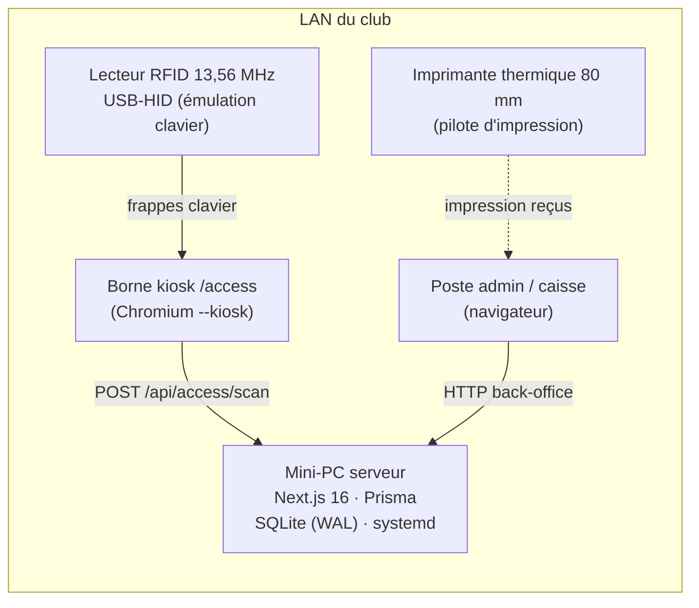
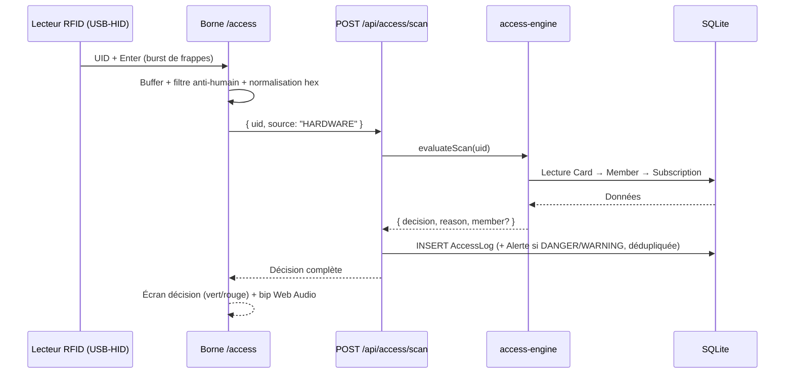
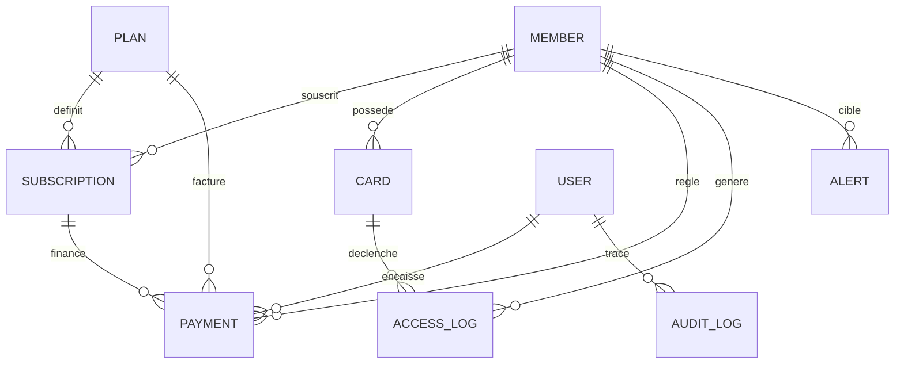

# PASSPro — Plan d'implémentation

> **Version** 1.0 · **Date** 10/09/2026 · **Statut** Prêt à implémenter
> **Pile** Next.js 16 (App Router) · Prisma · SQLite (WAL) · Tailwind CSS 4 · shadcn/ui
> **Déploiement** On-premise — mini-PC dans le club, réseau LAN uniquement
> **Design** La source de vérité visuelle est le fichier `DESIGN.md` (même dépôt)

## Sommaire

1. [Vue d'ensemble & décisions d'architecture](#1-vue-densemble--décisions-darchitecture)
2. [Architecture technique](#2-architecture-technique)
3. [Modèle de données (Prisma + ERD)](#3-modèle-de-données-prisma--erd)
4. [Contrat API](#4-contrat-api)
5. [Logique métier & RBAC](#5-logique-métier--rbac)
6. [Intégration matérielle (RFID, borne, imprimante)](#6-intégration-matérielle-rfid-borne-imprimante)
7. [Structure du projet & seed](#7-structure-du-projet--seed)
8. [Feuille de route (6 phases)](#8-feuille-de-route-6-phases)
9. [Tests & recette](#9-tests--recette)
10. [Exploitation on-premise](#10-exploitation-on-premise)

---

## 1. Vue d'ensemble & décisions d'architecture

### 1.1 Le produit en une phrase

PASSPro est une application web de gestion de club de fitness qui tourne **dans l'établissement**, pas dans le cloud : un mini-PC héberge le serveur et la base, une borne tactile gère les passages RFID en temps réel, la caisse encaisse les abonnements et édite des reçus thermiques 80 mm. Le périmètre fonctionnel couvre huit modules — tableau de bord temps réel, contrôle d'accès, adhérents, abonnements, cartes RFID, caisse, alertes et administration — tous décrits dans la spécification fonctionnelle dont ce plan est le pendant technique.

### 1.2 Cinq principes qui gouvernent toute l'implémentation

1. **Un seul process, une seule base.** SQLite en mode WAL suffit largement : un club gère quelques milliers de passages et quelques centaines d'encaissements par mois, pas des millions. Zéro service à exploser en production, la sauvegarde est une copie de fichier.
2. **La borne est un client comme les autres.** `/access` est une simple page Next.js rendue en plein écran. Aucun daemon séparé, aucun protocole propriétaire : le lecteur RFID parle « clavier » au navigateur, le navigateur parle HTTP au serveur.
3. **Le statut d'un abonnement est dérivé, jamais deviné.** Un unique module (`server/services/access-engine.ts` + `deriveStatus()`) décide si un abonnement est actif, expirent bientôt ou expiré. Tout le reste de l'application appelle ce module — y compris le dashboard, la caisse et la borne.
4. **Toute action sensible laisse une trace.** Une primitive `withAudit()` enveloppe les handlers qui modifient des données critiques (formules, adhérents, cartes, paramètres, comptes). Qui, quoi, avant, après — horodaté à la seconde.
5. **Simulation d'abord, matériel ensuite.** Chaque fonctionnalité dépendante du matériel (lecteur RFID, imprimante) possède un mode simulation qui produit exactement les mêmes appels API et les mêmes enregistrements. Le développement et la recette fonctionnelle se font sans matériel physique ; le branchement réel est une phase dédiée, pas un obstacle au milieu du projet.

### 1.3 Table des décisions d'architecture

| # | Décision | Choix retenu | Justification |
|---|----------|--------------|---------------|
| D1 | Framework | Next.js 16, App Router, React 19 | Routes `/members/[id]` natives, Server Components pour les listes, un seul process Node en production |
| D2 | UI | Tailwind CSS 4 + shadcn/ui | Composants headless accessibles, tokens du design system centralisés en variables CSS |
| D3 | Base de données | SQLite + Prisma (mode WAL) | Mono-établissement, zéro administration, sauvegarde = copie de fichier |
| D4 | Auth | Sessions cookie signées (iron-session), bcryptjs cost 12 | Simplicité en LAN, aucune dépendance externe, TTL 12 h (30 j pour le rôle ACCESS_GUARD sur la borne) |
| D5 | Mutations | Route Handlers `/api/**` (pas de Server Actions) | Contrat HTTP explicite, testable avec Vitest/Playwright, consommable par la borne et le back-office avec le même code |
| D6 | RFID | Mode `SIMULATION` par défaut, mode `HARDWARE` (USB-HID clavier, option Web Serial) | Développement sans matériel ; le moteur d'accès ignore complètement la source |
| D7 | Reçus | Rendu HTML dédié 80 mm + `window.print()` | Compatible avec toutes les imprimantes thermiques disposant d'un pilote d'impression ; ESC/POS direct en option (§6.4) |
| D8 | Montants | Entiers, en unités entières de la devise (DA par défaut) | La caisse des clubs du Maghreb travaille sans centimes ; bascule possible en unités mineures sans changement de schéma |
| D9 | Déploiement | Build standalone + service systemd + cron de sauvegarde SQLite | Mini-PC, redémarrage automatique, restauration testée en phase 5 |
| D10 | Localisation | `fr-FR`, devise et fuseau configurables (DA, Africa/Algiers par défaut) | Réglages établissement §4 ; les logs horodatés en UTC, affichage en heure du club |

### 1.4 Hors périmètre v1 (décision positive)

Pour tenir le délai (~4 semaines solo) et éviter la dérive du périmètre, ces points sont explicitement hors v1 : multi-établissements, paiement en ligne, application mobile, facturation TVA/comptabilité, synchronisation multi-sites, commande physique du tourniquet par le logiciel (l'ouverture reste pilotée par le couple lecteur/relais — voir §6.5). Chacun reste possible sans casser l'architecture : la base est mono-tenant par design simple (un `Setting` singleton), et le moteur d'accès expose une fonction pure qui pourra servir à un futur service de relais.

---

## 2. Architecture technique

### 2.1 Diagramme d'ensemble



Le serveur n'expose qu'un seul port (3000) sur le LAN. Il n'y a ni base externe, ni broker, ni service annexe : tout est dans le process Node. La commande physique du tourniquet ou de la gâche électrique est assurée par le matériel de contrôle d'accès (la plupart des lecteurs RFID grand public intègrent un relais déclenché à la lecture) ; PASSPro fournit la décision, l'affichage et l'audit — voir §6.5 pour les options de couplage.

### 2.2 Répartition serveur / client

- **Server Components par défaut** pour toutes les pages du back-office (listes, détails, dashboard) : les données sont chargées directement via Prisma au rendu, sans étape de fetch client inutile. Les pages restent rapides même sur un mini-PC modeste, et la charge SQL est minime.
- **Route Handlers pour toutes les mutations** (`POST/PATCH/DELETE`) et pour les endpoints interrogés par la borne (`/api/access/scan`, heartbeat). Règle d'or : **aucune logique métier dans les fichiers de route**. Un handler valide l'entrée, vérifie le rôle via `requireRole()`, puis délègue à un service de `server/services/`.
- **La borne `/access` est rendue hors du groupe de routes `(app)`** : pas de sidebar, pas de topbar, juste la machine à états plein écran (idle → scan → décision → retour idle). Elle tourne sous un compte dédié `ACCESS_GUARD` dont la session persiste 30 jours.

### 2.3 Cycle d'un scan RFID (chemin critique)



Latence cible mesurée de la dernière frappe à l'affichage : **< 150 ms** en local. Le chemin ne contient qu'une lecture indexée et une écriture — aucune optimisation exotique n'est nécessaire, mais le budget est vérifié en recette (§9).

### 2.4 Synchronisation des statuts d'abonnement

Les cinq statuts de l'abonnement se séparent en deux familles, et cette distinction structure le code :

- **Statuts manuels (stockés)** : `SUSPENDED`, `CANCELLED` — décisions humaines, posées via les endpoints dédiés, jamais recalculées.
- **Statuts temporels (dérivés à la lecture)** : `ACTIVE` (now ∈ [startDate, endDate)), `EXPIRING_SOON` (actif et reste ≤ 7 jours), `EXPIRED` (endDate < now). La fonction pure `deriveStatus(sub, now)` les calcule ; rien n'est stocké, donc rien ne peut devenir faux si le serveur est éteint trois jours.

Pour les **alertes** en revanche, qui sont des événements persistés, `src/instrumentation.ts` démarre un intervalle horaire : il reclasse les abonnements entrés dans la fenêtre d'expiration, crée les alertes `WARNING` manquantes (dédupliquées par type + membre + jour) et génère l'alerte `INFO` de passage à `EXPIRED`. Ce job est idempotent et rejouable sans risque de doublon.

### 2.5 Sécurité & sessions

- **Sessions** : cookie `httpOnly`, `SameSite=Lax`, signé (iron-session), secret `SESSION_SECRET` ≥ 32 octets en `.env`. TTL 12 h pour les postes admin/caisse, 30 j pour le rôle `ACCESS_GUARD` (la borne ne doit pas déconnecter quelqu'un un dimanche soir).
- **Mots de passe** : bcryptjs, cost 12, minimum 8 caractères à la création d'un compte opérateur. Le hash n'est jamais renvoyé par l'API (liste des comptes amputée du champ).
- **CSRF** : l'API est same-origin uniquement ; chaque mutation vérifie l'en-tête `Origin` contre l'hôte du serveur, en plus du cookie `SameSite=Lax`. Pragmatique et suffisant en LAN.
- **Brute force login** : compteur mémoire — 10 échecs par IP sur 5 min → 429 avec délai croissant.
- **RBAC** : middleware central `requireRole(handler, roles)` ; la matrice complète est en §5.4 et un test d'intégration vérifie que chaque endpoint refuse chaque rôle non autorisé (§9).
- **Audit** : §5.5 — primitive unique `withAudit()`.

### 2.6 Modes RFID : simulation vs matériel

La variable d'environnement `RFID_MODE=simulation|hardware` fixe le mode par défaut, surchargé par borne dans les Paramètres (`Setting.simulationMode`). En mode simulation, la console de `/access` propose des scénarios de test (carte inconnue, carte bloquée, adhérent à jour, adhérent expiré) qui appellent **exactement le même endpoint** `POST /api/access/scan` avec `source: "SIMULATION"`. Le moteur d'accès ne sait pas d'où vient le scan : seul le champ `source` du journal change. Conséquence directe : toute la logique d'accès est testée en simulation, et le passage au matériel réel n'ajoute que la couche de capture clavier (§6.1).

---

## 3. Modèle de données (Prisma + ERD)

### 3.1 Schéma Prisma complet

Dix modèles couvrent l'intégralité de la spécification fonctionnelle. Les identifiants métier sont assumés là où ils ont du sens : `Card.uid` est la clé primaire naturelle du badge (un UID ISO-14443A ne peut exister qu'une fois dans le parc), les autres entités utilisent `cuid()`.

```prisma
generator client {
  provider = "prisma-client-js"
}

datasource db {
  provider = "sqlite"
  url      = env("DATABASE_URL")
}

// ─── Administration ────────────────────────────────────────────────

enum Role {
  ADMIN
  MANAGER
  RECEPTIONIST
  ACCESS_GUARD
}

model User {
  id           String     @id @default(cuid())
  username     String     @unique
  name         String
  passwordHash String
  role         Role       @default(RECEPTIONIST)
  active       Boolean    @default(true)
  createdAt    DateTime   @default(now())
  payments     Payment[]
  auditLogs    AuditLog[]
}

model Setting {
  id             Int      @id @default(1) // singleton
  gymName        String   @default("PASSPro")
  gymPhone       String   @default("")
  gymEmail       String   @default("")
  gymAddress     String   @default("")
  currency       String   @default("DA")
  timezone       String   @default("Africa/Algiers")
  dateFormat     String   @default("dd/MM/yyyy")
  kioskName      String   @default("BORNE-01")
  simulationMode Boolean  @default(true)
  receiptFooter  String   @default("Merci de votre fidélité")
  updatedAt      DateTime @updatedAt
}

model AuditLog {
  id         String   @id @default(cuid())
  user       User?    @relation(fields: [userId], references: [id])
  userId     String?
  action     String   // "member.delete", "plan.update", "payment.reprint"…
  entityType String
  entityId   String
  before     String?  // JSON — champs modifiés uniquement
  after      String?  // JSON
  createdAt  DateTime @default(now())

  @@index([entityType, entityId])
  @@index([createdAt])
}

// ─── Adhérents & formules ──────────────────────────────────────────

model Member {
  id            String        @id @default(cuid())
  firstName     String
  lastName      String
  phone         String?
  email         String?
  notes         String?       // notes internes, jamais imprimées
  createdAt     DateTime      @default(now())
  updatedAt     DateTime      @updatedAt
  deletedAt     DateTime?     // soft delete
  subscriptions Subscription[]
  cards         Card[]
  payments      Payment[]
  accessLogs    AccessLog[]
  alerts        Alert[]
}

model Plan {
  id           String         @id @default(cuid())
  name         String         // "Mensuel", "Annuel"…
  price        Int            // unités entières de la devise (D8)
  durationDays Int            // 1, 7, 30, 90, 180, 365…
  description  String?
  active       Boolean        @default(true)
  sortOrder    Int            @default(0)
  subscriptions Subscription[]
  payments     Payment[]
}

// ─── Abonnements ───────────────────────────────────────────────────

enum SubscriptionStatus {
  ACTIVE
  EXPIRING_SOON
  EXPIRED
  SUSPENDED
  CANCELLED
}

model Subscription {
  id          String             @id @default(cuid())
  member      Member             @relation(fields: [memberId], references: [id])
  memberId    String
  plan        Plan               @relation(fields: [planId], references: [id])
  planId      String
  startDate   DateTime
  endDate     DateTime
  status      SubscriptionStatus @default(ACTIVE) // seuls SUSPENDED/CANCELLED sont stockés actifs (§2.4)
  suspendedAt DateTime?
  createdAt   DateTime           @default(now())
  updatedAt   DateTime           @updatedAt
  payments    Payment[]

  @@index([endDate])
  @@index([memberId, status])
}

// ─── Cartes RFID ───────────────────────────────────────────────────

enum CardStatus {
  ACTIVE
  BLOCKED
  UNASSIGNED
}

model Card {
  uid        String      @id // UID hex normalisé "04:A3:2B:F1"
  member     Member?     @relation(fields: [memberId], references: [id])
  memberId   String?
  status     CardStatus  @default(UNASSIGNED)
  lastSeenAt DateTime?
  createdAt  DateTime    @default(now())
  accessLogs AccessLog[]

  @@index([memberId])
}

// ─── Caisse ────────────────────────────────────────────────────────

enum PaymentMethod {
  CASH
  CARD
  OTHER
}

model Payment {
  id             String        @id @default(cuid())
  receiptNumber  String        @unique // REC-2026-0001 (§5.3)
  member         Member        @relation(fields: [memberId], references: [id])
  memberId       String
  subscription   Subscription? @relation(fields: [subscriptionId], references: [id])
  subscriptionId String?
  planId         String?       // historisé
  planName       String        // dénormalisé : immunise les reçus contre la suppression de formule
  amount         Int
  method         PaymentMethod @default(CASH)
  operator       User?         @relation(fields: [operatorId], references: [id])
  operatorId     String?
  createdAt      DateTime      @default(now())

  @@index([createdAt])
}

model Counter {
  key   String @id // "receipt-2026"
  value Int    @default(0)
}

// ─── Contrôle d'accès & alertes ────────────────────────────────────

enum AccessDecision {
  GRANTED
  DENIED
}

enum AccessReason {
  OK
  CARD_NOT_FOUND
  CARD_BLOCKED
  CARD_UNASSIGNED
  NO_ACTIVE_SUBSCRIPTION
  SUBSCRIPTION_EXPIRED
  SUBSCRIPTION_SUSPENDED
}

enum AccessSource {
  HARDWARE
  SIMULATION
}

model AccessLog {
  id        String         @id @default(cuid())
  cardUid   String         // copie texte : le log survit à la suppression de la carte
  member    Member?        @relation(fields: [memberId], references: [id])
  memberId  String?
  decision  AccessDecision
  reason    AccessReason
  kioskName String         @default("BORNE-01")
  source    AccessSource   @default(SIMULATION)
  createdAt DateTime       @default(now())

  @@index([createdAt])
  @@index([cardUid, createdAt])
}

enum AlertLevel {
  INFO
  WARNING
  DANGER
}

enum AlertType {
  EXPIRING_SUBSCRIPTION
  EXPIRED_SUBSCRIPTION
  UNKNOWN_CARD
  BLOCKED_CARD
}

model Alert {
  id        String     @id @default(cuid())
  level     AlertLevel @default(INFO)
  type      AlertType
  title     String
  message   String
  read      Boolean    @default(false)
  member    Member?    @relation(fields: [memberId], references: [id])
  memberId  String?
  cardUid   String?
  createdAt DateTime   @default(now())

  @@index([read, createdAt])
}
```

### 3.2 Diagramme entités-relations



### 3.3 Choix de modélisation & index

- **`Card.uid` en clé primaire.** Un badge est physiquement unique ; l'« association » et le « remplacement » d'un badge sont donc de simples mises à jour de `memberId` et de `status`. L'historique `AccessLog` copie l'UID en texte brut : un log reste lisible même si la carte est supprimée du parc par la suite.
- **`Payment.planName` dénormalisé.** Un reçu imprimé doit rester reproductible à l'identique même si la formule change de nom ou disparaît. Le prix historisé, lui, est lisible dans `amount`.
- **`Subscription` = état courant, `Payment` = historique.** Le renouvellement prolonge la ligne d'abonnement existante (mode EXTEND) ou la réinitialise (RESTART) ; ce sont les paiements liés, horodatés, qui tracent l'historique des ventes. Un abonnement n'a donc pas d'historique de versions — simplicité volontaire, l'audit d'administration et la caisse couvrent les besoins de traçabilité.
- **Soft delete sur `Member`** (`deletedAt`) : les listes filtrent, les logs et paiements conservent la référence. Suppression définitive non exposée en v1.
- **Index porteurs** : `AccessLog(createdAt)` alimente dashboard, fil d'activité et heatmap ; `AccessLog(cardUid, createdAt)` sert l'historique par badge ; `Subscription(endDate)` rend la requête « expirent sous 7 jours » triviale ; `Payment(createdAt)` et `Alert(read, createdAt)` couvrent caisse et cloche de notifications.

### 3.4 Règles de dérivation des statuts

| Statut | Règle | Nature |
|--------|-------|--------|
| `ACTIVE` | now ∈ [startDate, endDate) et aucune décision manuelle | dérivé |
| `EXPIRING_SOON` | `ACTIVE` et endDate − now ≤ 7 jours | dérivé |
| `EXPIRED` | endDate < now | dérivé |
| `SUSPENDED` | suspension manuelle (exclusion temporaire, litige) | stocké |
| `CANCELLED` | résiliation manuelle (désinscription) | stocké |

Règle de précédence : les décisions manuelles l'emportent sur la dérivation temporelle. Un abonnement `SUSPENDED` dont la date de fin est passée reste affiché `SUSPENDED` avec mention « expiré le JJ/MM/AAAA » — la suspension est une décision qui n'est pas annulée par le temps ; seule une action explicite (réactivation) change son statut.

---

## 4. Contrat API

### 4.1 Conventions

- JSON partout ; erreurs normalisées : `{ "error": { "code": "FORBIDDEN", "message": "…" } }` avec les codes HTTP 400 (validation), 401 (non authentifié), 403 (rôle insuffisant), 404, 409 (conflit métier), 500.
- Listes paginées : `?page=1&pageSize=20` → `{ "items": [...], "total": 143 }`.
- Dates en ISO 8601 UTC sur le fil ; tout formatage se fait côté client en `fr-FR` avec le fuseau de l'établissement (`Setting.timezone`).
- Rôles abrégés dans les tableaux : **A** = ADMIN, **M** = MANAGER, **R** = RECEPTIONIST, **G** = ACCESS_GUARD. « A » signifie aussi « tous les rôles supérieurs » (hiérarchie A > M > R > G pour les endpoints de consultation).

### 4.2 Endpoints — Authentification

| Méthode & route | Rôles | Payload / réponse |
|---|---|---|
| `POST /api/auth/login` | public | `{ username, password }` → `{ user }` + cookie de session |
| `POST /api/auth/logout` | tous | 204 |
| `GET /api/auth/me` | tous | `{ user }` — utilisé par la borne au démarrage |

### 4.3 Endpoints — Tableau de bord

| Méthode & route | Rôles | Payload / réponse |
|---|---|---|
| `GET /api/dashboard/metrics` | A M R | → `{ activeMembers, expiringSoon, expired, passagesToday, revenueToday, revenueMonth, blockedCards }` |
| `GET /api/dashboard/heatmap?days=28` | A M R | → `{ buckets: [{ day, hour, count }], peaks }` — grille 7 j × 12 créneaux de 2 h |
| `GET /api/dashboard/activity?limit=20` | A M R | → 20 derniers `AccessLog` avec adhérent et décision |

### 4.4 Endpoints — Adhérents

| Méthode & route | Rôles | Payload / réponse |
|---|---|---|
| `GET /api/members?q=&filter=all\|active\|inactive\|blocked&page=` | A M R | recherche instantanée nom, prénom, téléphone, email |
| `POST /api/members` | A M R | `{ firstName, lastName, phone?, email?, notes? }` |
| `GET /api/members/:id` | A M R | dossier 360° : membre + abonnement courant dérivé + carte + compteurs |
| `PATCH /api/members/:id` | A M R | modification des champs contact et notes |
| `DELETE /api/members/:id` | A M | soft delete (`deletedAt`) — toujours permis, logs et paiements conservés |
| `GET /api/members/:id/access-logs?limit=` | A M R G | historique des passages de l'adhérent |
| `GET /api/members/:id/payments` | A M R | historique des règlements (données de réimpression) |

### 4.5 Endpoints — Formules

| Méthode & route | Rôles | Payload / réponse |
|---|---|---|
| `GET /api/plans?includeInactive=true` | A M R | liste triée par `sortOrder` |
| `POST /api/plans` | A M | `{ name, price, durationDays, description?, sortOrder? }` |
| `PATCH /api/plans/:id` | A M | modification et activation/désactivation (`active`) |
| `DELETE /api/plans/:id` | A | 409 `PLAN_IN_USE` si des abonnements y réfèrent → désactiver à la place |

### 4.6 Endpoints — Abonnements

| Méthode & route | Rôles | Payload / réponse |
|---|---|---|
| `GET /api/subscriptions?status=all\|active\|expiring\|expired\|suspended&memberId=&page=` | A M R | statuts dérivés à la volée (§2.4) |
| `POST /api/subscriptions` | A M | création administrative **sans encaissement** (correction) — la voie normale de vente est `POST /api/payments` |
| `POST /api/subscriptions/:id/suspend` | A M | → statut `SUSPENDED` + `suspendedAt` + audit |
| `POST /api/subscriptions/:id/cancel` | A M | → statut `CANCELLED` + audit |
| `POST /api/subscriptions/:id/reactivate` | A M | → retour au statut dérivé (recalculé immédiatement) |

### 4.7 Endpoints — Cartes RFID

| Méthode & route | Rôles | Payload / réponse |
|---|---|---|
| `GET /api/cards?status=all\|active\|blocked\|unassigned&q=&page=` | A M R | recherche par UID, adhérent ; compteurs d'état dans la réponse |
| `POST /api/cards` | A M R | `{ uid, memberId? }` — création en stock ou attribution directe |
| `PATCH /api/cards/:uid` | A M R | `{ action: "ASSIGN"\|"BLOCK"\|"UNBLOCK", memberId? }` — blocage effectif au scan suivant immédiatement |
| `DELETE /api/cards/:uid` | A | sortie de parc — les logs conservent l'UID en texte |

### 4.8 Endpoints — Contrôle d'accès

| Méthode & route | Rôles | Payload / réponse |
|---|---|---|
| `POST /api/access/scan` | A M R G | `{ uid, source?: "HARDWARE"\|"SIMULATION" }` → décision complète (§5.1). Anti-rebond serveur : deux scans du même UID à moins de 1,5 s d'intervalle → même réponse, un seul log |
| `GET /api/access/logs?decision=all\|granted\|denied&q=&from=&to=&page=` | A M R G | journal d'audit des passages : filtres décision, texte libre (UID, adhérent, borne, motif), période |

### 4.9 Endpoints — Caisse

| Méthode & route | Rôles | Payload / réponse |
|---|---|---|
| `GET /api/payments?period=today\|week\|month\|all&memberId=&page=` | A M R | + synthèse `{ total, count }` pour la période |
| `POST /api/payments` | A M R | `{ memberId, planId, subscriptionId?, mode?: "EXTEND"\|"RESTART", method: "CASH"\|"CARD"\|"OTHER" }` → **transaction atomique** : Payment + création/prolongation Subscription + incrémentation Counter (numéro de reçu) + AuditLog. Un échec n'abandonne aucun artefact |
| `GET /api/payments/:id` | A M R | données complètes du reçu (établissement, titulaire, formule, période, montant, opérateur) |
| `POST /api/payments/:id/reprint` | A M R | trace la réimpression dans l'audit ; le reçu porte la mention « DUPLICATA » |

### 4.10 Endpoints — Notifications, paramètres, comptes, audit

| Méthode & route | Rôles | Payload / réponse |
|---|---|---|
| `GET /api/notifications?unread=true&page=` | A M R G | la cloche du topbar interroge `unread=true` toutes les 60 s |
| `POST /api/notifications/:id/read` | A M R | acquittement individuel |
| `POST /api/notifications/read-all` | A M R | « Tout acquitter » |
| `GET /api/settings` | tous | nécessaire partout (devise, en-tête reçus, mode simulation) |
| `PUT /api/settings` | A | modification + audit |
| `GET /api/users` | A | comptes opérateurs (jamais de `passwordHash` dans la réponse) |
| `POST /api/users` | A | `{ username, name, password, role }` — bcrypt cost 12 |
| `PATCH /api/users/:id` | A | `{ name?, role?, active?, password? }` |
| `DELETE /api/users/:id` | A | refus 409 si l'opérateur a encaissé des paiements → désactiver à la place |
| `GET /api/audit?entityType=&userId=&from=&to=&page=` | A | journal d'audit complet |
| `GET /api/health` | public | `{ ok: true }` — heartbeat de la borne (§6.3) |

---

## 5. Logique métier & RBAC

### 5.1 Le moteur d'accès (`server/services/access-engine.ts`)

Le moteur applique un ordre de vérification strict — du plus sûr au plus permissif — et retourne une décision exhaustive. Chaque scan produit **toujours** un `AccessLog`, qu'il soit autorisé ou refusé ; les refus notables déclenchent en plus une alerte, dédupliquée (même type + même UID/membre + fenêtre de 60 minutes) pour ne pas noyer la cloche de notifications.

```ts
export async function evaluateScan(rawUid: string): Promise<ScanResult> {
  const uid = normalizeUid(rawUid); // majuscules, sans espaces, séparés par ":"

  const card = await prisma.card.findUnique({
    where: { uid },
    include: { member: { include: { subscriptions: { orderBy: { endDate: "desc" }, take: 1 } } } },
  });

  if (!card) return deny(uid, "CARD_NOT_FOUND", "DANGER");
  if (card.status === "BLOCKED") return deny(uid, "CARD_BLOCKED", "DANGER");
  if (!card.memberId || !card.member) return deny(uid, "CARD_UNASSIGNED", "WARNING");

  const sub = card.member.subscriptions[0]; // la plus récente
  if (!sub) return deny(uid, "NO_ACTIVE_SUBSCRIPTION", "INFO");

  const derived = deriveStatus(sub, new Date());
  if (derived === "EXPIRED") return deny(uid, "SUBSCRIPTION_EXPIRED", "WARNING", card.member, sub);
  if (sub.status === "SUSPENDED") return deny(uid, "SUBSCRIPTION_SUSPENDED", "WARNING", card.member, sub);

  const daysRemaining = daysBetween(new Date(), sub.endDate);
  return grant(uid, card.member, sub, daysRemaining);
}
```

| Raison de refus | Condition exacte | Alerte |
|---|---|---|
| `CARD_NOT_FOUND` | UID absent de la base | `UNKNOWN_CARD` — DANGER |
| `CARD_BLOCKED` | `card.status = BLOCKED` (perte, vol, impayé) | `BLOCKED_CARD` — DANGER |
| `CARD_UNASSIGNED` | carte présente mais liée à aucun adhérent | WARNING |
| `NO_ACTIVE_SUBSCRIPTION` | adhérent sans aucun abonnement | INFO |
| `SUBSCRIPTION_EXPIRED` | abonnement le plus récent avec endDate < now | WARNING |
| `SUBSCRIPTION_SUSPENDED` | suspension manuelle en vigueur | WARNING |
| `OK` | abonnement actif (ou expirent bientôt : accès quand même) | — |

Réponse de `POST /api/access/scan` en cas de succès (le refus est structurellement identique, `member: null`) :

```json
{
  "decision": "GRANTED",
  "reason": "OK",
  "cardUid": "04:A3:2B:F1",
  "member": {
    "id": "cmg…", "firstName": "Amine", "lastName": "Belkacem",
    "planName": "Mensuel 30j", "startDate": "2026-08-28T00:00:00.000Z",
    "endDate": "2026-09-27T00:00:00.000Z", "daysRemaining": 17
  },
  "kioskName": "BORNE-01",
  "loggedAt": "2026-09-10T18:42:11.204Z"
}
```

Détail important : un abonnement `EXPIRING_SOON` reste un **accès autorisé** — le compte à rebours s'affiche à l'écran (et alimente les alertes), mais la borne laisse passer. La décision et la communication commerciale sont deux choses distinctes.

### 5.2 Renouvellement : EXTEND vs RESTART

Deux modes de renouvellement, choisis au moment de l'encaissement dans `POST /api/payments` (paramètre `mode`) :

- **`EXTEND` — prolongation.** `base = max(now, current.endDate)` puis `newEnd = base + plan.durationDays`. Si l'abonnement est encore actif, les jours restants sont intégralement préservés : renouveler à J-3 un 30 jours donne 33 jours de couverture. Si l'abonnement est déjà expiré, `base` retombe sur `now` — aucun jour « fantôme » rétroactif, ce qui éteint toute ambiguïté comptable.
- **`RESTART` — nouveau départ.** `startDate = now`, `endDate = now + plan.durationDays`. Utilisé quand l'adhérent revient après une coupure longue : il ne paie pas les jours perdus, il repart de zéro.

Trois règles complètent le mécanisme. La formule du renouvellement peut différer de l'abonnement d'origine (montée en gamme d'un mensuel vers un trimestriel sans opération supplémentaire). L'abonnement prolongé reste la même ligne en base — le `Payment` créé lors de l'opération, horodaté et rattaché à la formule, fait foi comme événement d'historique. Enfin, un abonnement `SUSPENDED` ou `CANCELLED` ne peut être renouvelé qu'après réactivation explicite : le endpoint retourne 409 `SUBSCRIPTION_NOT_RENEWABLE`, ce qui force le gestionnaire à trancher le litige avant d'encaisser.

### 5.3 Numérotation des reçus thermiques

Le numéro suit le format **`REC-{année}-{séquence sur 4 chiffres}`** (ex. `REC-2026-0001`). Le compteur vit dans la table `Counter` sous la clé `receipt-2026` : remise à zéro automatique chaque année (clé par année), séquence sans trou même en cas d'échec — l'incrément et le paiement partagent la même transaction Prisma, SQLite étant mono-écrivain il n'y a pas de course possible. La réimpression (`POST /api/payments/:id/reprint`) ne crée jamais de nouveau numéro : le duplicata réaffiche le numéro d'origine avec la mention « DUPLICATA » et l'action est tracée dans l'audit.

### 5.4 Matrice RBAC (4 rôles × actions)

| Action | ADMIN | MANAGER | RECEPTIONIST | ACCESS_GUARD |
|---|:-:|:-:|:-:|:-:|
| Consulter le dashboard & les KPIs | ✓ | ✓ | ✓ | — |
| Créer / modifier un adhérent | ✓ | ✓ | ✓ | — |
| Supprimer un adhérent | ✓ | ✓ | — | — |
| Créer / modifier / désactiver une formule | ✓ | ✓ | — | — |
| Vendre / renouveler un abonnement (caisse) | ✓ | ✓ | ✓ | — |
| Suspendre / annuler / réactiver un abonnement | ✓ | ✓ | — | — |
| Attribuer / bloquer / débloquer une carte RFID | ✓ | ✓ | ✓ | — |
| Passages : scan à la borne `/access` | ✓ | ✓ | ✓ | ✓ |
| Journal des passages (lecture) | ✓ | ✓ | ✓ | ✓ |
| Notifications : acquittement | ✓ | ✓ | ✓ | — |
| Paramètres de l'établissement | ✓ | — | — | — |
| Comptes opérateurs (RBAC) | ✓ | — | — | — |
| Journal d'audit | ✓ | — | — | — |

Lecture opérationnelle : la réceptionniste couvre tout le quotidien (adhérents, ventes, badges) sans pouvoir toucher aux tarifs ni supprimer ; le manager gère l'offre et les exclusions ; le garde de la borne ne voit que le contrôle d'accès — un compte `ACCESS_GUARD` n'a pas d'intérêt business à exposer plus.

### 5.5 Audit des actions sensibles

Primitive unique `withAudit()` appelée dans les handlers : `{ action, entityType, entityId, before, after }` avec les diffs en JSON compact (champs modifiés uniquement). Actions tracées : CRUD formules, suppression d'adhérent, attribution/blocage/déblocage de carte, suspension/annulation d'abonnement, encaissement et réimpression, modification des paramètres, gestion des comptes (création, rôle, activation, mot de passe). Le journal d'audit est en lecture seule pour tout le monde sauf ADMIN — il n'est jamais éditable, pas même par lui.

---

## 6. Intégration matérielle (RFID, borne, imprimante)

### 6.1 Lecteurs USB-HID (émulation clavier)

La grande majorité des lecteurs 13,56 MHz grand public (mode HID des ACR122U, lecteurs « clavier » génériques) se comportent comme un clavier : ils tapent l'UID en burst puis envoient Enter. La page `/access` capture cela avec un listener `keydown` global et une petite machine à états :

1. **Buffer** : chaque caractère s'ajoute au tampon courant ; Enter termine la lecture.
2. **Filtre anti-humain** : un intervalle inférieur à 12 ms entre deux frappes signe un lecteur (un humain tape à ≥ 80 ms par touche) ; à l'inverse, le tampon expire après 300 ms sans frappe.
3. **Normalisation** : suppression des non-hexadécimaux, majuscules, regroupement par paires → `04a32bf1` devient `04:A3:2B:F1`.
4. **Anti double-scan client** : même UID à moins de 1,5 s → ignoré (le serveur applique la même règle, défense en profondeur).
5. **Focus forcé** : la page refocusse un input fantôme en continu (`onBlur` → refocus), la borne n'a pas de souris.

### 6.2 Lecteurs série (option Web Serial)

Pour les lecteurs en mode CDC/série, la page détecte `navigator.serial` (Chromium uniquement) et ouvre le port à 9600 bauds, 8N1, lecture ligne par ligne. Activé par le paramètre `kioskSerial` des Paramètres. C'est un ajout de ~80 lignes dans le même module de capture ; l'API du scan ne change pas d'un octet.

### 6.3 La borne en production

- Lancement : `chromium --kiosk --noerrdialogs --disable-features=Translate,MediaRouter --autoplay-policy=no-user-gesture-required http://localhost:3000/access`, démarré par le service graphique du mini-PC (autologin session + `.desktop` autostart).
- Session : la borne se connecte une fois avec le compte `ACCESS_GUARD` ; le cookie de 30 jours évite toute reconnexion sauf révocation explicite par un ADMIN.
- Résilience : heartbeat `GET /api/health` toutes les 30 s ; trois échecs consécutifs → rechargement complet de la page (couvre un redémarrage du serveur sans intervention sur la borne).
- Son : Web Audio uniquement (aucun fichier) — bip accordé de succès (880 Hz, 120 ms) et de refus (220 Hz, 400 ms), audible dans la salle.

### 6.4 Imprimante thermique 80 mm

Voie par défaut, sans dépendance : le `ReceiptModal` rend le reçu dans une feuille CSS dédiée — `@page { size: 80mm auto; margin: 4mm }`, largeur utile 72 mm, corps en 12–13 px — et `window.print()` avec `@media print` masquant tout le reste de l'application. Toute imprimante thermique pilotée par le système (pilote générique ESC/POS des distributions Linux) imprime alors exactement l'aperçu. Voie avancée optionnelle (phase 5) : `node-thermal-printer` en ESC/POS direct sur USB si la qualité du pilote s'avère insuffisante — prévu comme remplacement encapsulé, pas comme refonte.

### 6.5 Couplage au tourniquet / gâche

PASSPro **décide** et **affiche** ; l'ouverture physique est du ressort du couple lecteur/relais, qui déclenche généralement l'ouverture à chaque lecture valide côté matériel. Deux conséquences pratiques sont assumées en v1 : d'une part la borne affiche en rouge les refus que le matériel peut néanmoins laisser passer physiquement (configuration relais à cadrer à l'installation, checklist §10.3) ; d'autre part un couplage logiciel direct (sortie GPIO/série pilotée par la décision) reste possible via une extension du service d'accès sans toucher au moteur — hors périmètre v1 (§1.4).

---

## 7. Structure du projet & seed

### 7.1 Arborescence Next.js 16

```
passpro/
├── prisma/
│   ├── schema.prisma
│   └── seed.ts                        # idempotent, réjouable
├── src/
│   ├── app/
│   │   ├── login/page.tsx             # hors shell
│   │   ├── access/page.tsx            # borne kiosk — hors shell, plein écran
│   │   ├── (app)/                     # groupe shell : sidebar + topbar
│   │   │   ├── layout.tsx
│   │   │   ├── page.tsx               # dashboard (/)
│   │   │   ├── members/page.tsx
│   │   │   ├── members/[id]/page.tsx  # dossier adhérent 360°
│   │   │   ├── plans/page.tsx
│   │   │   ├── subscriptions/page.tsx
│   │   │   ├── cards/page.tsx
│   │   │   ├── payments/page.tsx      # caisse + reçus
│   │   │   ├── access-logs/page.tsx
│   │   │   ├── notifications/page.tsx
│   │   │   └── settings/page.tsx      # établissement, matériel, comptes, audit
│   │   └── api/                       # route handlers = §4 (un dossier par ressource)
│   ├── components/
│   │   ├── ui/                        # shadcn/ui générés
│   │   └── business/                  # KpiCard, StatusPill, BadgeRFID, ScanResult,
│   │                                  # Heatmap, ReceiptModal, SubscriptionProgress…
│   ├── lib/
│   │   ├── db.ts                      # singleton Prisma
│   │   ├── session.ts                 # iron-session + requireRole()
│   │   ├── money.ts                   # format montants/devise
│   │   ├── dates.ts                   # fr-FR, fuseau établissement
│   │   └── errors.ts                  # ApiError + codes normalisés
│   ├── server/
│   │   └── services/
│   │       ├── access-engine.ts       # evaluateScan + alertes dédupliquées
│   │       ├── subscriptions.ts       # deriveStatus, EXTEND/RESTART
│   │       ├── payments.ts            # transaction caisse + Counter
│   │       ├── dashboard.ts           # métriques + heatmap
│   │       └── audit.ts               # withAudit()
│   └── instrumentation.ts             # job horaire d'alertes (§2.4)
├── systemd/passpro.service
├── scripts/backup.sh                  # cron sauvegarde SQLite
└── .env                               # DATABASE_URL, SESSION_SECRET, RFID_MODE
```

Les services vivent hors de `app/` : ils sont importables par Vitest sans contexte Next, ce qui rend la logique métier (moteur d'accès, renouvellements, caisse) directement testable unitairement. Les composants métier sont séparés des composants shadcn pour que `DESIGN.md` reste implémentable sans remous.

### 7.2 Seed réaliste (`prisma/seed.ts`)

Le seed sert deux objectifs : développer sans attendre de vraies données, et valider visuellement le dashboard. Il est idempotent (rejouer ne duplique rien) et **ne s'exécute jamais sur la base de production** (garde : variable `SEED=true` obligatoire).

| Donnée | Volume | Détails |
|---|---|---|
| Comptes | 4 | `admin`/`manager`/`reception`/`borne` — mot de passe de démo identique, à changer à la mise en service |
| Formules | 6 | À la journée 500 DA · Hebdo 2 000 DA · Mensuel 5 500 DA · Trimestriel 14 000 DA · Semestriel 25 000 DA · Annuel 45 000 DA |
| Adhérents | 24 | Noms algériens plausibles ; tous les cas : actif, expirent bientôt (J-2, J-5), expiré, suspendu, sans abonnement, carte bloquée |
| Cartes | 30 | 20 actives, 4 bloquées, 6 en stock ; UIDs hex réalistes |
| AccessLogs | ~400 | Répartis sur 28 jours, pics 17–21 h, creux 10–14 h, ~12 % de refus — la heatmap doit être visuellement crédible |
| Paiements | ~35 | Répartis sur 30 jours, méthodes mixtes, reçus séquentiels depuis `REC-2026-0001` |
| Alertes | ~8 | Mix non lues/lues, niveaux variés |

### 7.3 Renvoi design

La palette, l'échelle typographique, les composants (boutons, pilles de statut, tables, badge RFID holographique, ScanResult, heatmap, reçu 80 mm), les layouts de pages et les règles de motion sont spécifiés **dans `DESIGN.md`**, qui fait foi. Les tokens y sont directement transposables en variables `@theme` de Tailwind 4 — aucun choix de valeur hex ne se fait dans le code applicatif.

---

## 8. Feuille de route (6 phases)

Estimations pour un développeur solo, à temps plein. Chaque phase se termine par des critères d'acceptation **vérifiables** — si un critère tombe, la phase n'est pas finie, on ne « récupère » pas en aval.

| Phase | Contenu | Durée | Dépend de |
|---|---|---|---|
| **P0** | Fondations & auth | 1,5 j | — |
| **P1** | Référentiel : adhérents, formules, cartes | 3 j | P0 |
| **P2** | Abonnements & caisse | 3,5 j | P1 |
| **P3** | Moteur d'accès, borne, journal | 3,5 j | P1 |
| **P4** | Dashboard, alertes, audit | 3 j | P2 + P3 |
| **P5** | Matériel réel & durcissement | 2,5 j | P4 |
| **P6** | Recette & mise en service | 1,5 j | P5 |

**Total ≈ 19 jours ouvrés** (~4 semaines), marge de sécurité non incluse. P2 et P3 sont parallélisables si une deuxième personne arrive en cours de route.

### P0 — Fondations & auth (1,5 j)

Scaffold Next.js 16 + Tailwind 4 + shadcn/ui, schéma Prisma complet + migration, seed, `lib/session.ts` avec login/logout/me, `requireRole()`, shell applicatif (sidebar + topbar en pose sèche avec `DESIGN.md`). **Acceptation** : les 4 comptes du seed se connectent ; une route de test protégée renvoie 403 aux rôles non autorisés ; `prisma db seed` rejoué ne duplique rien ; le shell respecte la sidebar 240 px / topbar 64 px du design.

### P1 — Référentiel (3 j)

CRUD adhérents (recherche instantanée, filtres, création rapide), formules (durées prédéfinies 1/7/30/90/180/365, activation), parc de cartes (statuts, attribution, blocage/déblocage, compteurs), dossier adhérent en version statique (contact, badge RFID virtuel, commandes carte). **Acceptation** : recherche < 100 ms sur 1 000 adhérents ; bloquer une carte déclenche bien `CARD_BLOCKED` au scan simulé suivant ; les compteurs de la page Cartes correspondent au seed (20/4/6).

### P2 — Abonnements & caisse (3,5 j)

Vente (création par paiement), renouvellements EXTEND/RESTART, suspension/annulation/réactivation, page de suivi avec filtres de statut, journal de caisse avec périodes, `ReceiptModal` + impression 80 mm, transaction atomique paiement. **Acceptation** : renouveler à J-3 un 30 j en EXTEND donne 33 jours (test Vitest daté) ; un échec volontaire dans la transaction ne laisse ni paiement ni abonnement ni numéro de reçu ; le reçu s'imprime dans 72 mm de largeur utile avec numéro séquentiel.

### P3 — Moteur d'accès, borne, journal (3,5 j)

`access-engine.ts` + alertes dédupliquées, page kiosk `/access` (machine à états idle → scan → décision, console de simulation, capture clavier), journal des passages avec filtres décision/période/recherche. **Acceptation** : la matrice des 7 raisons est validée par les tests unitaires table-driven ; latence scan→affichage < 150 ms mesurée ; deux scans à < 1,5 s → un seul log ; la console de simulation couvre les 7 scénarios sans matériel.

### P4 — Dashboard, alertes, audit (3 j)

KPIs temps réel, heatmap 7 × 12, fil d'activité, widget de scan rapide, centre de notifications (cloche, acquittements), job horaire d'alertes, journal d'audit + `withAudit()` sur tous les handlers sensibles, RBAC finalisé partout. **Acceptation** : les 7 KPIs correspondent exactement aux comptes calculés à la main sur le seed ; aucune alerte dupliquée après 2 exécutions du job ; chaque action sensible de la matrice §5.5 laisse une ligne d'audit vérifiable.

### P5 — Matériel réel & durcissement (2,5 j)

Branchement lecteur HID réel (capture, anti-rebond, lecture à distance), imprimante thermique réelle, rate-limit login, vérification Origin CSRF, sauvegardes cron + test de restauration complet, systemd + autostart borne. **Acceptation** : 100 scans en rafale → 0 perte, 0 doublon ; reçu imprimé conforme à l'aperçu ; restauration d'une sauvegarde de la veille rejouée avec succès ; le serveur redémarre seul après `kill -9`.

### P6 — Recette & mise en service (1,5 j)

Suite Playwright au vert, checklist de mise en service §10.3 exécutée dans le club, fiche opérateur d'une page (ouvrir la caisse, vendre, renouveler, bloquer un badge), bascule `RFID_MODE=hardware` et désactivation du seed. **Acceptation** : les 3 parcours e2e critiques passent sur le matériel de production ; un opérateur non technique vend et renouvelle un abonnement en suivant la fiche seule.

---

## 9. Tests & recette

### 9.1 Tests unitaires (Vitest) — là où la valeur est

La logique métier est pure et donc testable sans mock : c'est là que 90 % de l'effort de test doit aller.

- **Moteur d'accès** — tests table-driven couvrant la matrice complète : (carte inexistante, bloquée, non assignée) × (sans abonnement, expiré, suspendu, actif, expirent bientôt) → décision + raison + niveau d'alerte attendus, y compris le cas limite `EXPIRING_SOON = accès autorisé` et la frontière exacte à J-7.
- **`deriveStatus`** — frontières temporelles : endDate = now, now + 7 jours pile, fuseau de l'établissement vs UTC.
- **Renouvellements** — EXTEND sur actif (jours préservés), EXTEND sur expiré (base = now), RESTART, changement de formule, refus sur SUSPENDED/CANCELLED.
- **Caisse** — séquence des reçus sans trou en cas d'erreur simulée, dénormalisation `planName`, atomicité de la transaction.
- **RBAC** — pour chaque endpoint de la matrice §5.4 : un appel avec chaque rôle non autorisé → 403.

### 9.2 Parcours e2e (Playwright)

Trois parcours uniquement, mais complets et exécutés à chaque pré-déploiement :

1. **Vente → accès** : login réceptionniste → créer un adhérent → vendre un mensuel (cash) → imprimer le reçu → scan simulé de la carte → ACCÈS AUTORISÉ avec les bonnes dates.
2. **Blocage → refus → alerte** : bloquer la carte d'un adhérent actif → scan → ACCÈS REFUSÉ `CARD_BLOCKED` → alerte DANGER présente dans la cloche.
3. **Retour après coupure** : adhérent expiré → renouvellement RESTART → scan → autorisé, avec les nouvelles dates.

### 9.3 Recette matérielle (manuel, phase 5)

| Vérification | Critère |
|---|---|
| Lecteur HID : lecture à 3 cm | UID correctement normalisé dans le log |
| Lecteur : 100 scans en rafale | 0 perte, 0 doublon |
| Imprimante 80 mm | Reçu conforme à l'aperçu, coupure nette |
| Bips | Audibles depuis l'entrée de la salle |
| Borne : coupure serveur | Reconnexion automatique < 60 s après retour |
| Borne : coupure électrique | Retour automatique au kiosk après redémarrage |

---

## 10. Exploitation on-premise

### 10.1 Build & service

Build standalone (`output: "standalone"`), lancement `node .next/standalone/server.js` sur le port 3000, dossier `data/` pour `passpro.db`. Service systemd :

```ini
[Unit]
Description=PASSPro - gestion club
After=network.target

[Service]
User=passpro
WorkingDirectory=/opt/passpro
EnvironmentFile=/opt/passpro/.env
ExecStart=/usr/bin/node .next/standalone/server.js
Restart=always
RestartSec=3

[Install]
WantedBy=multi-user.target
```

### 10.2 Sauvegardes & mises à jour

- **Sauvegarde** : cron horaire → `sqlite3 data/passpro.db ".backup '/backups/passpro-$(date +%F-%H).db'"` (backup en ligne sûr, sans arrêter le service) ; rétention 30 jours ; restauration = arrêter le service, remplacer le fichier, redémarrer — procédure testée en P5, pas seulement documentée.
- **Mise à jour** : `git pull && npm ci && npx prisma migrate deploy && npm run build && systemctl restart passpro`, hors heures d'ouverture ; rollback = redéployer le commit précédent, la base ne régresse pas (migrations forward-only).
- **.env de production** : `DATABASE_URL`, `SESSION_SECRET` (généré une fois), `RFID_MODE=hardware`, `NODE_ENV=production`. Le seed est impossible sans `SEED=true`.

### 10.3 Checklist de mise en service au club

1. Mini-PC : IP statique LAN, autologin session, Chromium kiosk en autostart.
2. Lecteur RFID branché et testé (3 scans de référence : carte stock, carte adhérent, carte inconnue).
3. Relais du tourniquet/gâche configuré en cohérence avec les décisions (§6.5).
4. Imprimante thermique : pilote installé, test de reçu réel.
5. Paramètres établissement renseignés (nom, adresse, devise, fuseau) — ils apparaissent sur les reçus.
6. Comptes opérateurs créés avec les rôles de la matrice §5.4, mots de passe de démo changés.
7. Seed absent de la base de production ; 3 parcours §9.2 rejoués sur site.
8. Sauvegarde horaire vérifiée (un fichier présent dans `/backups`, restaurable).

### 10.4 Limites assumées en v1

HTTPS non installé (LAN isolé) — si l'application devait être exposée au-delà du LAN, placer Caddy en reverse proxy et rendre obligatoire l'HTTPS avant tout. Pas de réplication ni de haute disponibilité : le mini-PC est redémarrable en < 60 s et la borne affiche un écran d'attente propre pendant ce temps ; la perte maximale acceptable est le temps depuis la dernière sauvegarde horaire. Ces choix sont cohérents avec le ticket d'entrée : un club, un serveur, zéro opération.


